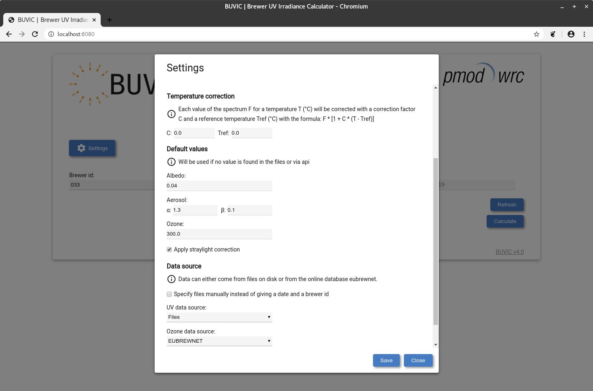

[](https://www.python.org/downloads/release/python-370/)
[](https://www.gnu.org/licenses/gpl-3.0) 
[](https://github.com/pec0ra/buvic/releases/)
[](https://github.com/pec0ra/buvic/actions)
[](https://hub.docker.com/r/pmodwrc/buvic/builds)


# Brewer UV Irradiance Calculation

This repository contains a set of tools to calculate the cosine corrected irradiance from brewer raw UV measurements.

## Table of content
<!--ts-->
   * [Brewer UV Irradiance Calculation](#brewer-uv-irradiance-calculation)
      * [Table of content](#table-of-content)
      * [Requirements](#requirements)
         * [Directory structure](#directory-structure)
         * [File formats](#file-formats)
      * [BUVIC Web Application](#buvic-web-application)
      * [Command Line App](#command-line-app)
         * [1. Calculate dates and brewer id](#1-calculate-dates-and-brewer-id)
         * [2. Calculate for given files](#2-calculate-for-given-files)
         * [3. Calculate for all files of a given directory](#3-calculate-for-all-files-of-a-given-directory)
         * [4. Watchdog (deprecated)](#4-watchdog-deprecated)
      * [Installer](#installer)
      * [Releases](#releases)
      * [Docker](#docker)
         * [1. BUVIC](#1-buvic)
         * [2. UV Watch (deprecated)](#2-uv-watch-deprecated)
      * [Implementation](#implementation)
         * [1. User Interface](#1-user-interface)
         * [2. Job creation / handling](#2-job-creation--handling)
         * [3. Calculations](#3-calculations)
         * [4. Performance](#4-performance)

<!-- Added by: basile, at: Di Jan  7 11:17:29 CET 2020 -->

<!--te-->

## Requirements

All python commands required python >= 3.7 and the libraries listed in [requirements.txt](requirements.txt).
These libraries can be installed with the pip command:
```
pip install -r requirements.txt
```

The Docker images require docker


### Directory structure

BUVIC needs access to three main directories:
1. An instrument directory (e.g. `instr`)
2. A uv data directory (e.g. `uvdata`)
3. An output directory (e.g. `output_dir`)

The instrument directory is where you put your instrument files. 
```
instr/
    arf_033.dat
    arf_070.dat
    ...
    UVR17319.070
    UVR17319.117
    UVR17419.033
    ...
    18.par
    19.par
```
It contains:
* ARF files with the name pattern `arf_<brewer_id>.dat`
* Calibration files with the name pattern `UVRXXXXX.<brewer_id>`
* Parameter files with the name pattern `<year>.par` where *year* is the last two digits of the year (e.g. 19)


The uv data directory is where you put your measurement files.
```
uvdata/
    B17019.033
    B17019.070
    B17119.033
    B17119.070
    ...
    UV17019.033
    UV17019.070
    UV17119.033
    UV17119.070
    ...
```
It contains:
* B files with the name pattern `B<days><year>.<brewer_id>` where *days* is the number of days since new year and *year* is the last two
digits of the year (e.g. 19)
* UV files with the name pattern `UV<days><year>.<brewer_id>` where *days* is the number of days since new year and *year* is the last two
digits of the year (e.g. 19)

Inside the instrument and uv data directories, you may use any directory structure that you want.
The files will be searched recursively into this structure.

Example of more complex structure:
```
instr/
    033/
        arf_033.dat
        UVR17419.033
    070/
        arf_070.dat
        UVR17019.070
        UVR17319.070
    18.par
    19.par
    ...

uvdata/
    033/
        2018/
            B17018.033
            UV17018.033
            ...
        2019/
            B17019.033
            B17119.033
            UV17019.033
            UV17119.033
            ...
    070/
        2018/
            B17018.070
            UV17018.070
            ...
        2019/
            B17019.070
            B17119.070
            UV17019.070
            UV17119.070
            ...
    ...
```

The output directory is the place where BUVIC will write its output files. BUVIC will automatically create a structure to group files by year.


### File formats

#### Parameter files

The parameter files are composed of multiple rows, where each row is composed of five values separated by a semicolon (`;`).

The first value of each row is the day since new year, the second value is the albedo, the third and fourth values are the angstrom's
alpha and beta of the aerosol and the fifth value is the cloud coverage (0 for no cloud and 1 for cloudy).

In the first line of the file, only the cloud coverage is optional. The other values cannot be empty.
For the following lines, the albedo, alpha and beta values can be omitted. If this is the case, the value of the last line with non empty value
is used.
If the cloud coverage is omitted in any line, the value will be retrieved from the [darksky](https://darksky.net/dev) api.

Here is an example of a parameter file content `19.par`:
```
10;0.1;1;0.1;
11;;1.2;0.2;1
12;0.3;;;0
14;0.5;1.5;0.5;
```


#### Output files

The output files are in the qasume format.
Their names have the following pattern: `<days><hour><minute>.<brewer_id>` and are placed in subdirectories with instrument id and year as
names. In the file name pattern, *days* is the number of days since new year and *hour* and *minute* is the time of the measurement.

Each qasume file begins with four header lines, each beginning with `% `.
The first header line contains information about the file generation.
The second header line contains the place of the measurement with its name, latitude and longitude.
The third line gives information about the parameter used for calculation. Each info has the format `<name>=<value>` and infos are
separated by a tabulation.
The value for `coscor` is followed by the cloud coverage in parenthesis if this value was taken from [darksky](https://darksky.net/dev).
The fourth line contains the headers for the three columns of data.

After the header, the following rows contain the data. Each row contains three values separated by white spaces: the wavelength, the spectral
irradiance and the time of the measurement (see the third line of the header for more details).

Here is an example of a (truncated) qasume file `1751130G.117`:
```
% Generated with Brewer UV Irradiance Calculation v2.1
% El Arenosillo 37.1N 6.73W
% type=ua	coscor=clear_sky(darksky:0.67)	tempcor=false	straylightcor=false	o3=312.1DU	albedo=0.04	alpha=1.3	beta=0.1
% wavelength(nm)	spectral_irradiance(W m-2 nm-1)	time_hour_UTC
290.0	 0.000001157	   11.50033
290.5	 0.000000000	   11.50133
291.0	 0.000000000	   11.50217
291.5	 0.000001131	   11.50300
292.0	 0.000008208	   11.50383
292.5	 0.000051625	   11.50467
293.0	 0.000050769	   11.50550
293.5	 0.000090523	   11.50633
294.0	 0.000153403	   11.50717
294.5	 0.000206659	   11.50800
295.0	 0.000307826	   11.50883
...
```


## BUVIC Web Application

BUVIC Web Application is a small application running in the browser to facilitate the execution of irradiance calculation.

It offers the possibility to choose dates and a brewer id to automatically find the measurement files from a predefined set or to manually upload measurement files (manual mode).




**Instructions:**

Run:
```
python run.py
```
The application should automatically open in the browser.

Alternatively (and the recommended way), you can use the docker image as described in [the docker section](#1-buvic).

## Command Line App

The command line offers 4 different possibilities to perform irradiance calculations.

1. Calculate for dates and brewer id
2. Calculate for given files
3. Calculate for all files of a given directory
4. Monitor a directory for changes and execute the calculation every time new measurement files are added (deprecated)

**Instructions:**

Help about the command line can be shown with:
```
python run_cmd.py -h
```
or
```
python run_cmd.py --help
```
which yields the result:
```
usage: run_cmd.py [-h]
                  (--dates-and-brewer-id DATE_START DATE_END BREWER_ID | --paths UV_FILE B_FILE UVR_FILE ARF_FILE | --all | --watch)
                  [--input-dir INPUT_DIR] [--output-dir OUTPUT_DIR]
                  [--albedo ALBEDO] [--aerosol ALPHA BETA] [--ozone OZONE]
                  [--no-coscor]

Calculate irradiance spectra

optional arguments:
  -h, --help            show this help message and exit
  --dates-and-brewer-id DATE_START DATE_END BREWER_ID, -d DATE_START DATE_END BREWER_ID
                        The dates, in iso format (e.g. 2019-03-24, and the id
                        of the brewer to get the data from
  --paths UV_FILE B_FILE UVR_FILE ARF_FILE, -p UV_FILE B_FILE UVR_FILE ARF_FILE
                        The paths to the files. UV_FILE: The file containing
                        the raw uv measurements. B_FILE: The file containing
                        the ozone measurements. UVR_FILE: The UVR file
                        containing calibration data. ARF_FILE: The file
                        containing the arf data
  --all                 Finds and converts all UV files in the input directory
  --watch, -w           Watches the input directory for file changes and
                        automatically converts changed UV files
  --input-dir INPUT_DIR, -i INPUT_DIR
                        The directory to get the files from
  --output-dir OUTPUT_DIR, -o OUTPUT_DIR
                        The directory to save the results in
  --albedo ALBEDO, -a ALBEDO
                        The albedo value to use for the calculations
  --aerosol ALPHA BETA, -e ALPHA BETA
                        The aerosol angstrom's alpha and beta values to use
                        for the calculations.
  --ozone OZONE, -z OZONE
                        The ozone value in DU to use for the calculations if
                        no value is found in a B file
  --no-coscor, -c       Don't apply cos correction
```
The options `--days-and-brewer-id`, `--paths`, `--all` and `--watch` correspond to the 4 different ways to run the tool and only one can be used at a time.

The options `--input-dir`, `--output-dir`, `--albedo`, `--aerosol` , `--ozone` and `--no-coscor` are optional parameters and can be used with any of the 4 options cited above. If not specified, default values will be used.

### 1. Calculate dates and brewer id

This command search for measurements between two dates for a brewer id from a preset of files.
The dates are given in iso format `yyyy-mm-dd`

**Examples:**

Run the calculation for brewer `070` on June 24th, 25th and 26th and write the output in the `brewer117` directory:
```
python run_cmd.py --days-and-brewer-id 2019-06-24 2019-06-26 070 --output-dir brewer177/
```

Run the calculation for brewer `186` on June 25th and 26th with an albedo of 0.1 and angström's alpha of 1.3 and beta of 0.1 as aerosol (using shortcuts flags `-d`, `-a` and `-e` instead of their full versions).
```
python run_cmd.py -d 2019-06-25 2019-06-26 186 -a 0.1 -e 1.3 0.1
```
Note that if `--input-dir` is not specified, the measurement files will be taken from `data/`.

### 2. Calculate for given files

This command executes the calculation for four given measurement files:
1. UV File: Raw uv measurements
2. B File: For ozone measurements
3. UVR File: The instrument calibration data
4. ARF File: The angular response of the instrument

**Examples:**

Run the calculation for the four files in the directory `my_measurement_files`:
```
python run_cmd.py --input-dir my_measurement_files/ --paths UV17519.070 B17519.070 UVR17319.070 arf_070.dat
```
Note that if `--input-dir` is not specified, the file paths are relative to the working directory.

Run the calculation for the four files with an albedo of 0.1 and angström's alpha of 1.3 and beta of 0.1 as aerosol (using shortcuts flags `-p`, `-a` and `-e` instead of their full versions).
```
python run_cmd.py -p data/UV17519.070 data/B17519.070 data/UVR17319.070 data/arf_070.dat -a 0.1 -e 1.3 0.1
```

### 3. Calculate for all files of a given directory

Find all pair of UV and B files in a directory and run calculations for each them.
Calculations will be skipped if UVR and ARF files are not available.

**Examples:**

Run the calculations for all the files found in the `data` directory and write the output to the `output` directory:
```
python run_cmd.py --all data/ -o output/
```
Note that `--input-dir` has no effect for this command.

### 4. Watchdog (deprecated)

Monitor a directory for new files and run the calculation for every new/modified pair of UV and B files.
Calculations will be skipped if UVR and ARF files are not available.

```
python run_cmd.py --watch --input-dir measurements/
```
Note that if `--input-dir` is not specified, the measurement files will be taken from `data/`.

Alternatively, you can use the docker image as described in [the docker section](#2-uv-watch)

## Installer

`installer.py` is a small script to help deploy the docker UV Server image.

**Instructions:**

`installer.py` requires python 3+.
To run the script:
```
python installer.py
```
or on linux simply:
```
./installer.py
```
Then follow the instructions on terminal


## Releases

Releases have a version in the form `vMAJOR.MINOR` (e.g `v1.2`).

To create a new release, create a new tag with the version as a name:
```
git tag v1.2 -a -m "UV Server v1.2"
```
and push it to github:
```
git push --tags
```
Docker hub will automatically build the corresponding docker image (Note: it can take a few hours until the images are built).

Alternatively, you can run the script `release.py <version>` which will do this automatically.

## Docker

Two docker images are available for calculations:
1. `pmodwrc/buvic`: A small web app to help launching calculations
2. `pec0ra/uv-watch`: A watchdog to automatically execute the calculations when files are changed in a directory

### 1. BUVIC

This docker image contains the [UV Web Application](#buvic-web-application)

#### Demo command

The simplest way to start a docker container with buvic is to run:
```
docker run -d -p <HOST_PORT>:80 --name buvic pmodwrc/buvic
```
Where `<HOST_PORT>` is the port on which the web app will listen (e.g. 8080).

The flag `-d` tells docker to run this container as a daemon (in the background). It may be omitted if you want to run it in your current terminal.

After running this command, you can access the web app in your browser at `http://localhost:<HOST_PORT>`.
This instance of BUVIC however only uses some demo measurement files as input.


#### Mapping directories

To use BUVIC correctly, you will need to map input and output directories of your host machine to your docker container.

There are three relevant directories that need to be mapped (see [Directory structure](#directory-structure) for more details):
1. `/instr`
2. `/uvdata`
3. `/out`

Each of these directories needs to be mapped to a directory on your host computer.
We use docker volumes (the option `-v`) to map a host directory to a docker directory.
When mapping a host directory (e.g. `/home/user/buvic_data`) to a docker directory (e.g. `/path/in/docker/buvic_data`), the directory inside
the docker container will share the contents of the host directory.

Here is an example of command which maps host directories to `/instr`, `/uvdata` and `/out`:
```
docker run -d -p <HOST_PORT>:80 -v <INSTR_DIRECTORY>:/instr -v <UVDATA_DIRECTORY>:/uvdata -v <OUTPUT_DIRECTORY>:/out --name buvic pmodwrc/buvic
```
where `<INSTR_DIRECTORY>` is the *absolute* path to the instrument directory on the host (e.g. `D:\buvic\instr` on Windows or
`/home/user/buvic/instr` on Linux), `<UVDATA_DIRECTORY>` is the *absolute* path to the uv data directory on the host and `<OUTPUT_DIRECTORY>`
is the *absolute* path to the directory you want to save the outputs in.


#### Permissions

On linux machines, you may want to specify which user/group runs the docker container to avoid permission issues when writing to the output
directory.
This can be done with the parameter `--user <user_id>:<group_id>` or simply `--user $(id -u):$(id -g)` to use the current user and group.

Note that if you use another user than root, you will not get permission to listen to port 80 (the default port for buvic inside the
container).
A workaround for this is to specify on which port buvic will listen with the environment variable `PORT`. This is done by adding the
following parameter to your docker run command 
```-e PORT=<PORT_NUMBER>```
where `<PORT_NUMBER>` is the port number to use (must be greater than 1024 for non root users).

Example:
```
docker run -d -p <HOST_PORT>:4444 --user 1000:1000 -e PORT=4444 --name buvic pmodwrc/buvic
```
Notice that for the `-p` option, we don't use 80 anymore but the port specified with the `PORT` environment variable (4444 in this example).


#### Darksky

If you want [darksky](https://darksky.net/dev) to be used, you will need to create an account and give your api key as environment variable.
Using this functionality is not required and the cloud coverage values can be manually entered in the parameter file instead.

You can pass your darksky api token to BUVIC by adding the parameter `-e DARKSKY_TOKEN=your_darksky_token`.
Example:
```
docker run -d -p <HOST_PORT>:80 -e DARKSKY_TOKEN=your_darksky_token --name buvic pmodwrc/buvic
```


### 2. UV Watch (deprecated)

This docker image contains the [UV Watchdog](#4-watchdog)

**Instructions:**

To build this image, run:
```
docker build -f Dockerfile.watch . -t pec0ra/uv-watch
```
Note that the tag `pec0ra/uv-watch` can be replaced with another custom tag


To start a docker container, run:
```
docker run --d -v <WATCH_PATH>:/in -v <OUT_PATH>:/out --user $(id -u):$(id -g) --name uv-watch pec0ra/uv-watch
```
Where:

`<WATCH_PATH>` is the *absolute* path to the directory you want to monitor

`<OUT_PATH>` is the directory in which to save the generated csv files

The flag `-d` tells docker to run this container as a daemon (in the background).
It may be ommited if you want to run it in your current terminal.

The `--user $(id -u):$(id -g)` option tells docker to run the container as the current user.
This prevents permissions issues at the moment of writing files to the output directory.
It is optional and you might need to skip it on Windows.

After running this command, any new pair of UV and B files added/modified in `<WATCH_PATH>` will automatically be converted an irradiance spectrum saved in `<OUT_PATH>`


## Implementation

For this implementation section, we will split the functionality of the application in the following parts:

1. User Interface
2. Job creation / handling
3. Calculations


### 1. User Interface

Two user interfaces are available:
1. Command line interface (CLI)
2. Graphical User Interface (GUI)

Both interfaces are responsible for getting the necessary parameters from the user.
The parameters include dates and brewer id to find the required files for the calculations as well as some settings.


The first interface's implementation is written in [`run_cmd.py`](run_cmd.py) and mostly consists of command line argument parsing.
Once the arguments are parsed, their values are passed to the `CalculationUtils` (See [next section](#2-job-creation--handling)).

The second interface's implementation is more complex and consists of the following three files:
1. [`run.py`](run.py) (or [`docker/run_docker.py`](docker/run_docker.py) for the docker image) which serves as an entry point to start the UVApp.
2. [`buvic/app.py`](buvic/app.py) which contains the UVApp class.
3. [`buvic/gui/widgets.py`](buvic/gui/widgets.py) which contains the implementation of some of the more complex interface's widgets.

The UVApp class is the core of the GUI and uses the [remi library](https://github.com/dddomodossola/remi).
The class initializes the widgets in its `main` method and adds them to its main container.

The most important of the interface's widgets are the `MainForm`s (`PathMainForm` to give files as input and `SimpleMainForm` to give dates
and brewer id as input). They keep track of the values of their fields and settings and call the `FileUtils` and `CalculationUtils` (See
[next section](#2-job-creation--handling)) with these values when the *Calculate* button is clicked.


### 2. Job creation / handling

Job creation and handling is done in the classes [`FileUtils`](buvic/logic/file_utils.py) and [`CalculationUtils`](buvic/logic/calculation_utils.py).

Before creating the jobs, all the information required for the Jobs is written in a `CalculationInput` object.
Each `CalculationInput` corresponds to one UV file (measurements for one day). Since multiple measurements are done each day (in each UV
file), the UV file is divided into sections, each represented as a `UVFileEntry` object.
In the end, one Job will be created for each `UVFileEntry`. Each Job needs therefore to get a `CalculationInput` as parameter as well as the
index of the section it does the calculation for.

Jobs can be created in four different ways:
1. `calculate_for_input`: Create jobs for a given `CalculationInput`. Used when file paths are already known.
2. `calculate_for_all_between`: Finds all the files for measurements between two days and create the jobs for them.
3. `calculate_for_all`: Finds all files in a directory and create the jobs for them
4. `watch` (deprecated): Monitors a directory and each time a file is found, calls `calculate_for_input`.

The difference between way 1. (and 4.) and ways 2. and 3. is that way 1 only create Jobs for one `CalculationInput`.
Ways 2. and 3. make calculation for multiple days and therefore create Jobs for multiple `CalculationInput` objects.

All the Jobs are then scheduled on a `ThreadPoolExecutor` and will run in parallel.


### 3. Calculations

The calculations executed in each Job from the [previous section](#2-job-creation--handling) are mostly implemented in
[`IrradianceCalculation`](buvic/logic/irradiance_calculation.py).
The entry point in this class for the calculations is the method `calculate` as explained in the [previous section](#2-job-creation--handling),
this method has access to a `CalculationInput` object for infos about the measurement files and extra parameters as well as the index of the
section to do the calculations for.


Before starting the the calculation, all the required data is collected by parsing the measurement files or querying eubrewnet for the data.
Each file type has its own data provider. Their implementations can be found in the files
[`buvic/logic/uv_file.py`](buvic/logic/uv_file.py), [`buvic/logic/ozone.py`](buvic/logic/ozone.py),
[`buvic/logic/arf_file.py`](buvic/logic/arf_file.py), [`buvic/logic/calibration_file.py`](buvic/logic/calibration_file.py)
and [`buvic/logic/parameter_file.py`](buvic/logic/parameter_file.py).

Note that the file parsing is triggered automatically (and cached) when calling one of the following property on the `CalculationInput`:
* `uv_file_entries`: get the uv data from a UV file or eubrewnet
* `ozone`: get ozone data from a B file or eubrewnet
* `calibration`: get calibration data from a UVR file or eubrewnet
* `arf`: parses the arf file
* `parameters`: parses the parameter file

An api call is also made to [darksky.net](https://darksky.net/dev) (if an api key is provided) to get the cloud cover for the day of the
measurements. This information is used to choose between a clear sky or a diffuse cos correction.

During the calculations, the raw measurements and the calibration data is used to convert the raw UV measurements to a calibrated spectrum.
A call to LibRadtran is made with the infos from the measurement and parameter files to get `Fdiff`, `Fdir` and `Fglo`.

Finally, the results from LibRadtran and from the darksky.net api call are used to apply the cos correction to the calibrated
spectrum.
This information as well as the input parameters used is returned from the `calculate` method as a `Result` object.

This `Result` object will later be converted to output files.


### 4. Performance

The two main performance bottlenecks in this application are:
1. API calls to EUBREWNET and [darksky.net](https://darksky.net/dev)
2. Calls to libradtran

Any other file parsing or calculation takes a negligible time in comparison to these two actions.

To improve significantly the performance of BUVIC, we use parallelization for these actions. This works best for API calls since we expect
to be able to make many API calls at the same time before the internet connection is saturated. The calls to libradtran also
have a performance gain from parallelization, thanks to the overhead of creating and handling the new process executing uvspec.

Parallelization is implemented with the python's `ThreadPoolExecutor` which makes it easy to run jobs on a pool of threads. Relevant code
parts are in the class [`CalculationUtils`](buvic/logic/calculation_utils.py) in methods `calculate_for_inputs` (data collection) 
and `_execute_jobs` (calculation jobs). The number of threads used in the pool equal the number of cpu cores plus 4 with a limit at 20
threads.
