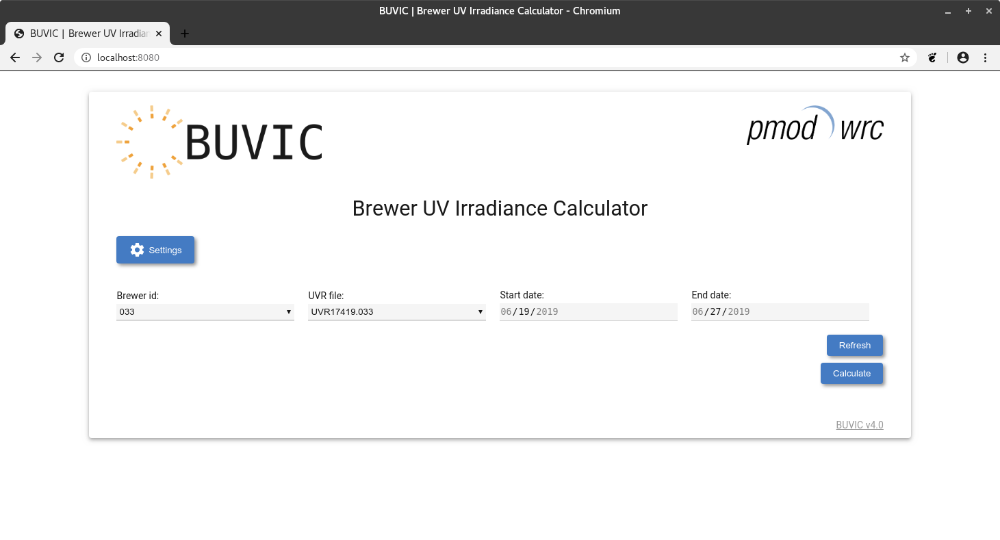

 

# Brewer UV Irradiance Calculation

BUVIC is a small application running in the browser that executes calculations of cosine corrected irradiance from brewer raw UV measurements.

It can execute these calculations for chosen dates and brewer id and the corresponding measurement can either be read from the file system
or retrieved from eubrewnet.

# Documentation

Information about BUVIC's usage and implementation can be found in the [wiki](https://github.com/pec0ra/buvic/wiki)

   * [Home](https://github.com/pec0ra/buvic/wiki)
   * [About](https://github.com/pec0ra/buvic/wiki/about)
       * [What is BUVIC](https://github.com/pec0ra/buvic/wiki/about#what-is-buvic)
       * [What can it do](https://github.com/pec0ra/buvic/wiki/about#what-can-it-do)
   * [Usage](https://github.com/pec0ra/buvic/wiki/usage)
       * [Docker](https://github.com/pec0ra/buvic/wiki/usage#docker)
          * [Requirements](https://github.com/pec0ra/buvic/wiki/usage#requirements)
          * [Installer](https://github.com/pec0ra/buvic/wiki/usage#installer)
          * [Demo command](https://github.com/pec0ra/buvic/wiki/usage#demo-command)
          * [Mapping directories](https://github.com/pec0ra/buvic/wiki/usage#mapping-directories)
          * [Permissions](https://github.com/pec0ra/buvic/wiki/usage#permissions)
          * [Darksky](https://github.com/pec0ra/buvic/wiki/usage#darksky)
       * [Python App](https://github.com/pec0ra/buvic/wiki/usage#python-app)
          * [Requirements](https://github.com/pec0ra/buvic/wiki/usage#requirements-1)
   * [Contributing](https://github.com/pec0ra/buvic/wiki/contributing)
       * [License](https://github.com/pec0ra/buvic/wiki/contributing#license)
       * [Code style](https://github.com/pec0ra/buvic/wiki/contributing#code-style)
       * [Releases](https://github.com/pec0ra/buvic/wiki/contributing#releases)
       * [Implementation Details](https://github.com/pec0ra/buvic/wiki/contributing#implementation-details)
          * [User Interface](https://github.com/pec0ra/buvic/wiki/contributing#1-user-interface)
          * [Job creation / handling](https://github.com/pec0ra/buvic/wiki/contributing#2-job-creation--handling)
          * [Calculations](https://github.com/pec0ra/buvic/wiki/contributing#3-calculations)
          * [Performance](https://github.com/pec0ra/buvic/wiki/contributing#4-performance)

# License

BUVIC is published under the `GNU General Public License version 3` (GPL v3). See [LICENSE.md](LICENSE.md) for more details.
